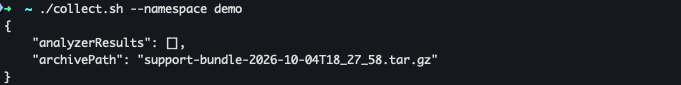

Use `mode: local` when you have `kubectl` access to production yourself. Collection runs on your own machine, using your own credentials.

## Step 1: Download the `router-diagnostics` collect script

Download this once, onto the machine you'll collect from, and make it executable:

```bash
curl -sSLo collect.sh https://router.apollo.dev/router-diagnostics-collect/latest
chmod +x collect.sh
```

This gives you a single `./collect.sh` command, which caches a pinned version of [troubleshoot's `support-bundle` binary](https://troubleshoot.sh/docs/support-bundle/introduction) locally, keyed by version, before running collection.
## Step 2: Install the Helm chart

**If you deployed your router with the official Apollo Helm chart:**

```bash
helm install router-diagnostics oci://registry-1.docker.io/apollograph/router-diagnostics-chart \
  --namespace production \
  --set namespace=production \
  --set mode=local
```

`namespace` is the only value you need to supply, the chart's collectors target your router by its standard `app.kubernetes.io/name=router` label.

**If you're on a raw-manifest or custom deployment:**

```bash
helm install router-diagnostics oci://registry-1.docker.io/apollograph/router-diagnostics-chart \
  --namespace production \
  --set namespace=production \
  --set selector="app=my-router" \
  --set configMapName=my-config \
  --set mode=local
```

Because none of the official chart's conventions apply to your deployment, supply your pod selector and ConfigMap name in addition to the namespace so the chart's collectors know where to find your router and its configuration.
Optionally, supply `metricsPort` if your metrics aren't exposed via the default `9090`.

## Step 3: Collect a support bundle

```bash
./collect.sh --namespace production
```

This is the same command whichever deployment tier you're on. `collect.sh` only takes `--namespace`.

`--namespace` here must match the value you gave both `helm install --namespace` and `--set namespace=` in Step 2. `collect.sh` uses that value to find the spec ConfigMap that the chart rendered there. For an explanation, go to [local-mode-details](/docs/router-support-tool/local-mode-details).

Run it again any time you want another bundle.



Note: `collect.sh` prints a JSON summary like `{"analyzerResults": [], "archivePath": "support-bundle-<timestamp>.tar.gz"}` when it finishes. An empty `analyzerResults` array is expected be because this tool ships no analyzers.

The bundle lands in your current directory as `support-bundle-<timestamp>.tar.gz`. Inspect it, keep it, or attach it to a support ticket.

## Cleaning up

Installing the chart leaves the spec ConfigMap plus Helm release metadata. If you'd rather leave nothing behind:

```bash
helm uninstall router-diagnostics --namespace production
```

If you expect to collect more than once, leaving the chart installed means subsequent runs only require rerunning the script, `./collect.sh --namespace production`, for example, with no reinstall.
