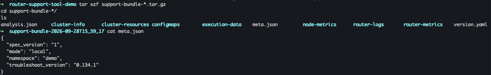

The GraphOS Router Support Tool collects an on-demand, sanitized support bundle for any Kubernetes-hosted router deployment. 
It produces a diagnostic snapshot of your router and its Kubernetes environment including router version, router config, logs, pod health, and metrics into a single sanitized archive, on demand, without affecting your router.

## The problem it solves

Getting the full picture when something goes wrong has historically meant a manual, back-and-forth process: `kubectl describe`, hunting down `router.yaml`, grepping logs, and screenshotting a dashboard. By contrast, this tool gathers everything at once so you can diagnose and fix the issue yourself or point support to exactly the right problem.

What's collected by the tool includes:

- Router version and startup configuration
- Current and previous-container logs (so a router that already restarted still has its history captured)
- Pod status, restart counts, and resource limits
- A point-in-time Prometheus metrics snapshot, if you expose one
- Sanitized router.yaml including secrets, tokens, and credentials stripped out automatically before the bundle ever leaves your cluster

Go to [Data Collected](./data-collected) for the full per-signal breakdown—what each one requires, what it costs in permissions, and what's lost if you decline it.

And it does this without touching Apollo's systems. You generate and store the bundle entirely within infrastructure you control, locally on disk or in a bucket you own. Apollo only sees it if and when you choose.

The support tool is built on top of [troubleshoot.sh](https://troubleshoot.sh/), the open-source Kubernetes support-bundle framework, so collection and redaction are handled by their engine. The GraphOS Router Support Tool adds everything around it: what to collect, how the spec reaches your cluster, how you trigger a collection, and where the resulting bundle goes. We have also built custom redactors that ensure tokens, credentials, connection strings, and IP addresses are stripped automatically, along with router-specific values like JWT/auth configuration.

A few things we built in deliberately:

- Generic secrets are stripped automatically, on every file, with no configuration. Environment-variable-named secrets (password, token, *_SECRET_ACCESS_KEY, and similar), credentials embedded in URLs, database connection strings, and a handful of Kubernetes-specific patterns (like last-applied-configuration annotations) are all redacted unconditionally, before the bundle is written.

- Router-specific sensitive fields get their own redaction rules, because generic pattern-matching doesn't know your router.yaml's shape. This covers JWT verification and subgraph auth configuration, literal header values in your headers config, GraphQL operation bodies that reach router logs, subgraph routing URLs, TLS private keys (supergraph, subgraph, and connector TLS config), and Redis credentials, whether embedded in a cache connection string or set as separate username/password fields.

- It's safe to run against a router that's already degraded. Every collector gathers its signal externally, from the Kubernetes API, kubelet metrics, or an HTTP endpoint, rather than executing inside your router's container, so running the tool doesn't compete with your router process for CPU or memory.

## How collection runs

Getting the spec into your cluster is done through a single Helm chart, `router-diagnostics-chart`, with a `mode` value controlling how collection actually runs:

- **`mode: local`**: You run collection yourself, from your own machine, with your own `kubectl` access.
- **`mode: job`**: A Kubernetes Job runs collection in-cluster, for teams whose `kubectl` access to production is restricted and who need a platform team to run it on their behalf.

Both modes install the troubleshoot.sh `support-bundle` engine at a version Apollo pins—using a standalone collection script for `mode: local`, or baked into the published Job image for `mode: job`—so results are reproducible regardless of whatever else happens to have been installed already.

See the [Getting Started guide](./getting-started/getting-started) to pick a mode and get a first support bundle collected.

## Support bundle output

The tool produces a single artifact:

support-bundle-2026-09-11T14_32_00.tar.gz

Every bundle also includes a `meta.json`, generated at chart-install time: `spec_version`, `mode` (`local` or `job`), `namespace`, and the pinned `troubleshoot_version` this run used, plus `sidecar_injection_disabled` for `mode: job`. It's a fixed snapshot of what the chart was configured to do and is useful for confirming which pin or mode produced a given bundle, but it can't tell you why a section came back empty.

From there, it's yours. Inspect it, keep it, or attach it to a support ticket.

## Get Started

Ready to try it out? Go to the [Getting Started guide](./getting-started/getting-started).